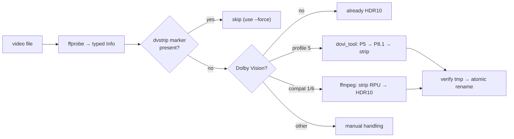

# dvstrip

[](https://github.com/Belphemur/dvstrip/actions/workflows/ci.yml)
[](https://github.com/Belphemur/dvstrip/actions/workflows/release.yml)
[](https://github.com/Belphemur/dvstrip/pkgs/container/dvstrip)

`dvstrip` finds **4K HDR10** video files that also carry **Dolby Vision** and normalizes them to plain HDR10 — **without re-encoding**. Video, audio and subtitle streams are copied bit-for-bit; only the Dolby Vision RPU / enhancement-layer metadata is stripped.

Why? Many players (older TVs, some media servers without a DV license) mishandle DV-tagged HDR10 files: washed-out colors, wrong brightness, or outright refusal to play. Since DV profiles 7.6/8.x already contain a complete HDR10 base layer, the DV metadata can simply be removed — a remux, not a transcode.

Processed files are stamped with a container-level `dvstrip` tag so re-runs skip them automatically, and `--replace` mode overwrites the original **only after the output has been verified** (probe succeeds, resolution unchanged, DV gone, marker present) via an atomic rename.

Every conversion shows a live per-file progress bar (bytes processed via ffmpeg's machine-readable progress, ETA included), one line per concurrent worker:

```
strip DV ██████████████░░░░░░  61% | 34.2 GiB/55.8 GiB | ETA 2m14s
```

## Quick start

```bash
# 1. See what a file is and what dvstrip would do with it
dvstrip check /media/movies/dune.mkv

# 2. Dry-run a whole library: classify everything, touch nothing
dvstrip scan /media/movies --dry-run

# 3. Normalize for real
dvstrip scan /media/movies

# 4. In place instead of side-by-side copies
dvstrip scan /media/movies --replace

# 5. Daemon mode: process everything dropped into a folder, forever
dvstrip watch /media/incoming --full-scan
```

Docker (preferred — every tool included, no host deps):

```bash
docker run --rm -v /media:/media ghcr.io/belphemur/dvstrip:latest scan /media/movies --dry-run
docker run -d --restart unless-stopped -v /media/incoming:/incoming \
  ghcr.io/belphemur/dvstrip:latest watch /incoming --full-scan
```

## How it works in one diagram



Every step is lossless stream copy — pixels are never decoded. Detail: [docs/how-it-works.md](docs/how-it-works.md).

## Requirements (host install only; the Docker image bundles all of these)

| Tool | Why |
|---|---|
| ffmpeg ≥ 7.1 (or jellyfin-ffmpeg) | `hevc_metadata=remove_dovi` bitstream filter — check with `ffmpeg -h bsf=hevc_metadata` |
| ffprobe | Metadata detection |
| dovi_tool | DV profile 5 conversion only |
| hdr10plus_tool | Optional |

Install from source: `go install github.com/Belphemur/dvstrip@latest`

## Flags

| Flag | Default | Description |
|---|---|---|
| `-w, --workers` | `0` (auto) | Concurrent ffmpeg workers; `0` = `NumCPU/2` clamped to `[2,8]` |
| `--dry-run` | `false` | Classify only, never touch files |
| `--force` | `false` | Reprocess files even if the `dvstrip` marker tag is present |
| `--replace` | `false` | Overwrite the original after a verified conversion |
| `--suffix` | `.hdr10` | Output suffix before the extension (ignored with `--replace`) |
| `--p5-mode` | `convert` | DV profile 5 handling: `convert` \| `skip` |
| `--hdr10plus` | `false` | Preserve HDR10+ when present, fall back to HDR10 otherwise |
| `--debounce` | `5s` | Watch mode: settle time per changed file |
| `--full-scan` | `false` | Watch mode: scan the whole tree once at startup |
| `--no-progress` | `false` | Disable per-file progress bars (on by default; forced off with `--log-json`) |
| `--log-level` | `info` | `trace` \| `debug` \| `info` \| `warn` \| `error` |
| `--log-json` | `false` | JSON log lines (for log collectors) |
| `-e, --extensions` | `.mkv .mp4 .ts .m2ts` | Video extensions to consider |

Config file (`dvstrip.yaml` in cwd or `~/.config/dvstrip/`) and env vars (`DVSTRIP_WORKERS=4`, …) are supported. Precedence: **flags > env > config > defaults**. See [`dvstrip.yaml`](dvstrip.yaml).

## Documentation

| Doc | Contents |
|---|---|
| [docs/how-it-works.md](docs/how-it-works.md) | Pipeline architecture: probe → classify → queue → convert → verify → publish |
| [docs/hdr-metadata.md](docs/hdr-metadata.md) | HDR10 / DV primer: profiles 5/7/8, compat IDs, what stripping removes, P5 caveat |
| [docs/configuration.md](docs/configuration.md) | Full config reference: flags, env vars, YAML keys |
| [docs/docker.md](docs/docker.md) | Image layout, multi-arch, daemon setups, unRAID/NAS notes |
| [docs/development.md](docs/development.md) | Testing, linting, CI/CD, cutting a release |

## Safety model (short version)

ffmpeg never writes onto the input. Output goes to `.<name>.mkv.swp` **next to the source** (a hidden, Vim-style swap file that keeps the extension), gets **verified** by a fresh probe (parses, same width, DV gone, marker present), and only then `os.Rename` publishes it — atomic on POSIX. The hidden `.swp` name is ignored by media scanners (Plex/Jellyfin/…) and by dvstrip's own scan/watch filter. A failed/killed run leaves the original untouched — the tmp is deleted on every error path, and stale `.swp` files from a hard crash (`SIGKILL`/power loss) are swept on the next scan. **`--replace` keeps no backup.** `--dry-run` overrides everything.

Details: [docs/how-it-works.md](docs/how-it-works.md#the-tmp--verify--publish-protocol).

## Caveats

- **DV profile 5 colors:** a P5 base layer is not true HDR10 (IPTPQc2). After `dovi_tool -m 2` reshaping + strip, DV-aware players render it correctly via the RPU path; as plain HDR10 the colors are *approximate*. A definitive fix needs a re-encode — out of scope. Use `p5-mode: skip` to leave them alone.
- **HDR10+:** existing HDR10+ SEI metadata survives stream copy and is preserved. Synthesizing HDR10+ *from* DV isn't supported by quietvoid's tools, so `--hdr10plus` falls back to plain HDR10 when the source has none.

## License

[GPL-3.0](LICENSE)
