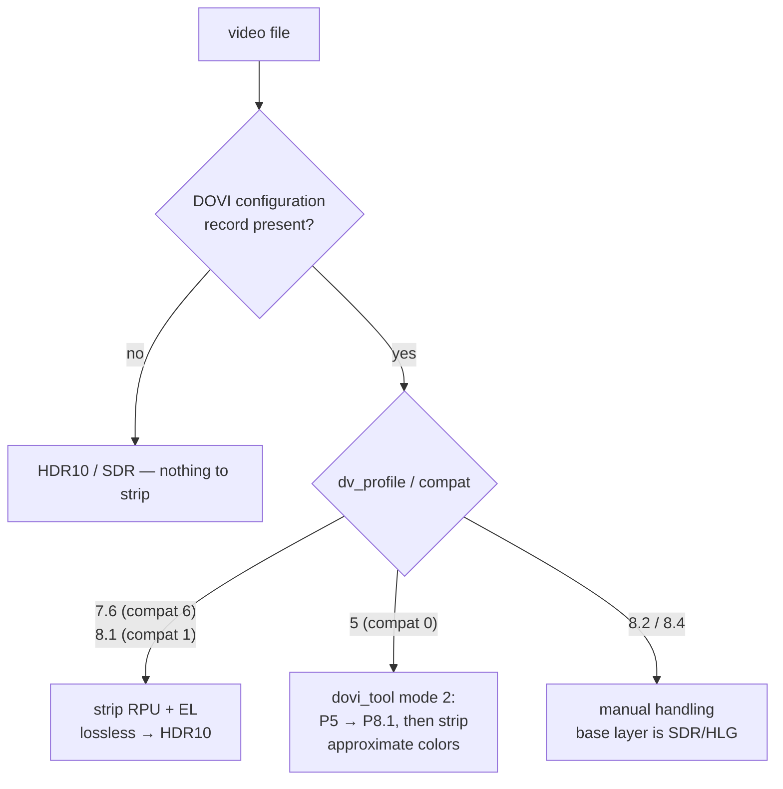

# HDR10, Dolby Vision & what dvstrip removes

A short primer on the metadata formats dvstrip reasons about, and why "stripping DV" can be lossless.

## The layers of HDR signaling

A video file's "HDR-ness" is a stack of metadata, from container-level down to per-frame bitstream data:

1. **Container tags** (MKV/MP4): title, custom tags — and dvstrip's `dvstrip=1` marker lives here.
2. **Stream color metadata**: `color_transfer`, `color_primaries`, `color_space`, bit depth (`pix_fmt`).
3. **Mastering-display / static metadata**: HDR10's MaxCLL/MaxFALL, display primaries.
4. **Dynamic metadata**: per-frame or per-shot instructions — **Dolby Vision RPU** and **HDR10+ SEI** messages.

`dvstrip` only ever removes items from layer 4 (and the container flag that advertises them). The pixel data is never decoded.

## Reading the color metadata

| Field | HDR10 | HLG | SDR |
|---|---|---|---|
| `color_transfer` | `smpte2084` (PQ) | `arib-std-b67` | `bt709` |
| `color_primaries` | `bt2020` | `bt2020` | `bt709` |
| `pix_fmt` | `yuv420p10le` | `yuv420p10le` | `yuv420p` |

dvstrip's rule: **HDR10 = `smpte2084` + `bt2020`**. Width ≥ 3840 makes it "4K".

## Dolby Vision profiles that matter here

Dolby Vision is advertised in a `DOVI configuration record` side-data entry, which ffprobe exposes along with two key integers: `dv_profile` and `dv_bl_signal_compatibility_id` ("compat ID").

| Profile | Typical source | Base layer | Compat ID | dvstrip action |
|---|---|---|---|---|
| 7.6 | UHD Blu-ray remux (HEVC) | HDR10 (BL + enhancement layer, possibly dual-layer MEL/FEL) | 6 | **Strip** — BL is genuine HDR10 |
| 8.1 | Web/streaming DL (HEVC or AV1) | HDR10 single layer | 1 | **Strip** — BL is genuine HDR10 |
| 8.2 | Streaming | SDR base layer | 2 | Warn/manual (not HDR10 underneath) |
| 8.4 | Streaming | HLG base layer | 4 | Warn/manual |
| 5 | Streaming (Apple TV, etc.) | **Not** HDR10 — proprietary IPTPQc2 color | 0 | **Convert**: reshape RPU to P8.1 via `dovi_tool -m 2 convert --discard`, then strip |

**Note on AV1**: Dolby Vision in AV1 is carried as ITU-T T.35 metadata OBUs (not HEVC NAL units). Stripping requires ffmpeg ≥ 9.0 (`dovi_rpu=strip=1` bitstream filter) — the older `hevc_metadata=remove_dovi=1` only works for HEVC.



### Why stripping 7.6/8.1 is lossless

Those profiles are literally "HDR10 plus extra per-frame refinement data". The RPU (Reference Processing Unit) metadata and any enhancement layer are *additive*. Removing them yields the untouched HDR10 base layer — every player that understands HDR10 then gets a perfect picture.

### The profile 5 caveat (read this before converting)

Profile 5's base layer is encoded in Dolby's IPTPQc2 color space and is **not** valid HDR10. `dovi_tool -m 2` reshapes the *RPU mapping* so a DV-aware player renders it as 8.1, but the raw base layer's primaries are still not BT.2020/PQ.

- On a **Dolby Vision capable player**: correct.
- On an **HDR10-only player after stripping**: *approximately* right colors — often acceptable, sometimes visibly off (the classic "green/purple tint" cases).
- **Pixel-perfect** conversion requires a real re-encode (e.g. ffmpeg + libplacebo tone mapping), which is deliberately out of scope for dvstrip's lossless guarantee.

If that trade-off bothers you, set `p5-mode: skip` and handle P5 files manually.

## HDR10+

HDR10+ is Samsung/Amazon's royalty-free answer to DV: per-shot dynamic metadata in HEVC SEI messages. dvstrip does not generate it (quietvoid's `dovi_tool generate` goes the *other* direction, HDR10+ → DV), but:

- HDR10+ SEIs **survive `-c copy` automatically**, so a DV+HDR10+ hybrid file keeps its HDR10+ after the DV strip.
- With `--hdr10plus`, dvstrip logs whether HDR10+ was preserved or why the output stays plain HDR10.

## The marker tag

After conversion, dvstrip stamps the container:

```
dvstrip=1
comment=dvstrip: dv -> hdr10 @ 2026-08-09T19:22:41Z
```

`dvstrip check` shows them; every subsequent run skips the file (unless `--force`). MP4 lowercases tag keys, so detection is case-insensitive.
