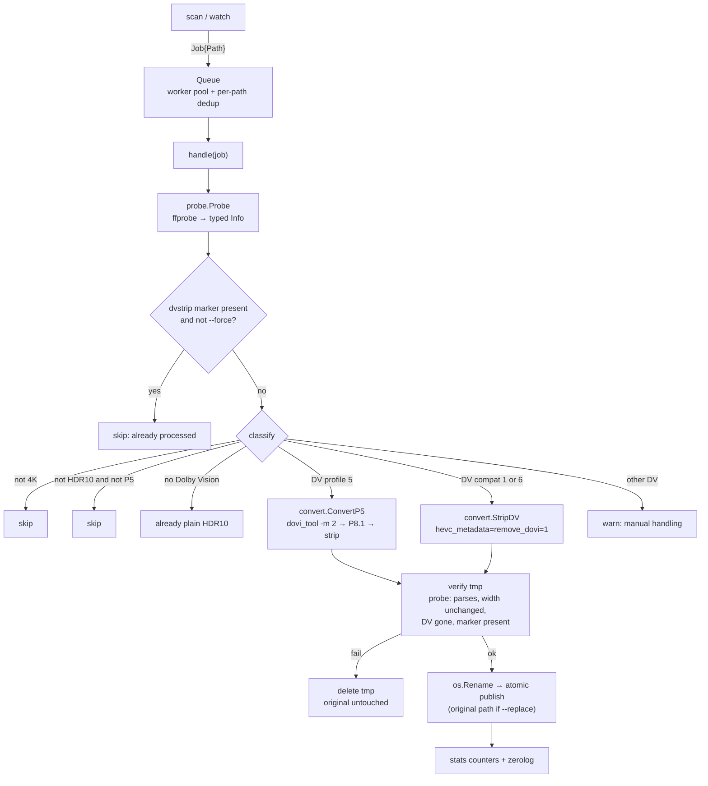

# How dvstrip works

This document describes the internal pipeline, from the moment a path is discovered to the moment a normalized file appears on disk.

## Pipeline overview



Each stage is described below.

## 1. Detection — `internal/probe`

`probe.Probe` shells out to ffprobe:

```
ffprobe -v error -select_streams v:0 \
  -show_entries stream=codec_name,width,height,pix_fmt,color_transfer,color_primaries:stream_side_data:format_tags \
  -of json <path>
```

The JSON is decoded into `probe.Info`, which answers five questions:

| Method | Rule |
|---|---|
| `Is4K()` | `width >= 3840` |
| `IsHDR10()` | `color_transfer == smpte2084` **and** `color_primaries == bt2020` |
| `HasDV` | a side-data entry `side_data_type == "DOVI configuration record"` exists; captures `dv_profile` and `dv_bl_signal_compatibility_id` |
| `HasHDR10Plus` | any side-data type containing `hdr10+` (case-insensitive) |
| `Processed` | container format tag `dvstrip` present, or a `comment` tag containing `dvstrip` — matched case-insensitively because **MP4 lowercases tag keys** while MKV preserves them |

`Info.Action()` collapses all of that into a single human-readable decision (`strip-dv`, `convert-p5`, `skip (…)`, …) which is exactly what `dvstrip check` prints.

**Testing seam:** `probe.Parse(raw []byte)` contains all the parsing/classification logic with no subprocess involved. Unit tests feed recorded ffprobe JSON fixtures through `Parse`; `Probe` is just "run ffprobe, then `Parse`".

## 2. Queueing — `internal/queue`

A fixed worker pool fed by a buffered channel (`workers * 8` capacity):

- `Submit` deduplicates by path with a `sync.Map` (`LoadOrStore`). A file being copied fires dozens of fsnotify `Write` events; after debounce you might still get the same path twice — only the first lands in the queue.
- `Wait` is a `sync.WaitGroup` over submitted-but-unfinished jobs; `scan` and watch-shutdown both call it to drain before exiting.
- `Submit` blocks when the buffer is full → the directory walk itself becomes the backpressure mechanism.
- **Auto worker count** (`--workers 0`, the default): `NumCPU/2` clamped to `[2, 8]`. Remuxing is I/O-bound and each ffmpeg stream-copy uses well under one core, so half the cores keeps disks busy without thrashing HDD arrays.

## 3. Conversion — `internal/convert`

### Normal path: `StripDV` (DV compat 1/6 — profiles 7.6, 8.1)

```
ffmpeg -hide_banner -loglevel error -nostats -y \
  -i <in> -map 0 -c copy \
  -bsf:v:0 hevc_metadata=remove_dovi=1 \
  -max_muxing_queue_size 2048 \
  -metadata dvstrip=1 \
  -metadata comment="dvstrip: dv -> hdr10 @ <RFC3339>" \
  .swp.dvstrip.<in>
```

`-c copy` means **stream copy**: no decoding, no re-encoding, bit-identical A/V/S. The only change is the removal of RPU/enhancement-layer NAL units by the `hevc_metadata` bitstream filter, plus the two container tags. The filter is pinned to `v:0` (the probed video stream) because `-map 0` also carries attached covers (mjpeg), which reject the HEVC-only filter.

### Profile 5 path: `ConvertP5`

DV profile 5 has no HDR10-compatible base layer (it uses IPTPQc2 colors), so a bare strip would produce broken colors. The pipeline instead reshapes the DV metadata first — still no pixel re-encoding:

1. `ffmpeg -i <in> -map 0:v:0 -c:v copy -bsf:v hevc_mp4toannexb -f hevc <tmp>/bl.hevc` — extract the raw HEVC video.
2. `dovi_tool -m 2 convert --discard bl.hevc -o p8.hevc` — convert the RPU mapping from profile 5 to 8.1 and discard the enhancement layer.
3. Remux: `-i p8.hevc -i <in> -map 0:v -map 1 -map -1:v -map_chapters 1 -c copy -bsf:v hevc_metadata=remove_dovi=1` — video from the converted stream, everything else (audio, subs, chapters) from the original, DV metadata stripped, marker stamped.

See [hdr-metadata.md](hdr-metadata.md) for why this is done and the color-accuracy caveat.

### The tmp → verify → publish protocol

Both paths end in `publish()`:

1. **tmp**: ffmpeg writes to `.swp.dvstrip.<name><ext>` (e.g. `.swp.dvstrip.movie.mkv`) **in the same directory** as the source (same filesystem ⇒ atomic rename later). The leading dot makes it a hidden dotfile, so media scanners ignore it while it is in flight, and the video extension stays *last* in the name because ffmpeg picks the output muxer from the filename extension (an unknown suffix like `.tmp` makes it abort with "Unable to choose an output format"). Since the name now matches the scan/watch extension allow-list, `convert.IsTemp` (basename prefix match, checked before the extension filter in directory walks) is the explicit guard. The tmp file is unconditionally removed on return by a `defer` inside `StripDV`/`P5`, so a failed remux, a failed verification, a panic, or `os.Exit` all leave nothing behind — after a successful `publish` the rename has already moved it away and the removal is a no-op.
2. **verify**: the tmp file is re-probed with `probe.Probe`. Failure conditions (any of → delete tmp, keep original, report error):
   - probe fails to parse the file,
   - width changed vs. the source,
   - DV metadata is still present,
   - the source carried HDR10+ and the output no longer does (the ST 2094-40 SEI must survive the strip),
   - the `dvstrip` marker tag is missing.
3. **publish**: `os.Rename(tmp, final)` — POSIX rename-over is atomic. With `--replace`, `final` is the original path; otherwise it's `<name><suffix>.<ext>` (default `.hdr10`).

Consequences:

- `--replace` can never leave a half-written file: the original exists untouched until the verified rename.
- A hard crash (`SIGKILL`/power loss) can leave a `.swp.dvstrip.<name>.mkv` behind — in-process deferrals can't run. The next `scan` or `watch` sweep detects and removes it (logged at warn level; the retired `*.dvstrip.tmp` suffix is also still swept).
- In `watch` mode, the rename itself fires fresh fsnotify events on the original path — the debounced re-probe then finds the `dvstrip` marker and logs `[already processed]`, so there is no feedback loop. (Queue dedup + marker check are the two guards.)

## 4. Marker & idempotency

Every produced file carries two container-level tags written in the same remux pass (zero extra cost in MKV/MP4):

- `dvstrip=1` — machine-readable marker
- `comment=dvstrip: <from> -> <to> @ <timestamp>` — human-readable provenance

`probe` reads them back via `format_tags`. `handle` skips marked files unless `--force` is set. This is the primary idempotency mechanism; the secondary one is filename-based (`isOwnOutput`: `.swp.dvstrip.`-prefixed dotfiles and `<suffix>`-stemmed names are never enqueued).

## 5. Watch mode

- fsnotify is **not** recursive: at startup every existing subdirectory is added, and newly created directories are added on their `Create` event.
- `--full-scan` enqueues the whole tree once before going live. Queue dedup makes any overlap with watcher events harmless.
- Copying a file in produces a burst of `Write` events; each path gets a `time.AfterFunc` timer that is reset on every event (**debounce**, default 5s). Only when a file has been quiet for the debounce window is it submitted.
- SIGINT/SIGTERM (wired through cobra's command context via `signal.NotifyContext`) stops the loop, drains the queue with `Wait()`, prints the summary counters, exits 0.

## 6. Logging, stats & progress bars

All log output goes through a single zerolog instance configured in `cmd/root.go` (`--log-level`, `--log-json`; console writer otherwise). Every file-scoped event carries a `file=<basename>` field. Run-end summary counters (scanned / skipped / marked / already-hdr10 / stripped / failed) are atomic and printed by `scan` and by `watch` on shutdown.

Progress display is on by default (`--no-progress` opts out; `--log-json` forces it off). ffmpeg never uses `-stats` — the raw `frame=…` line is what used to garble the log stream. Instead:

1. ffmpeg runs with `-nostats -progress pipe:1`, emitting machine-readable `key=value` blocks.
2. `convert.runFFmpeg` parses `total_size=N` lines and feeds them into `internal/display.Tracker`, keyed by file path (bar max = source file size; stream-copy output ≈ input, so the estimate is accurate).
3. `dovi_tool` (no progress output) gets an indeterminate spinner instead.
4. The tracker renders every active bar as its own line at the bottom of the terminal (ANSI cursor-up + clear-line redraw at 120 ms). **All log writes go through the tracker's writer**, which clears the bar block before printing and schedules a redraw — so logs and bars never interleave.

## Where things live

| Path | Responsibility |
|---|---|
| `cmd/root.go` | cobra root, viper binding, logger + tracker setup, signal context, PATH checks |
| `cmd/common.go` | `handle` (probe → classify → strip), `submitDir`, filters, stats |
| `cmd/check.go` | single-file structured report |
| `cmd/scan.go` | recursive one-shot scan |
| `cmd/watch.go` | fsnotify loop, debounce, `--full-scan` |
| `internal/probe` | ffprobe wrapper (`Probe`) + pure parser/classifier (`Parse`, `Info.Action`) |
| `internal/convert` | `StripDV`, `P5`, ffmpeg progress plumbing, tmp/verify/publish |
| `internal/display` | multi-bar terminal renderer (one line per in-flight conversion) |
| `internal/queue` | worker pool, dedup, `AutoWorkers` |
