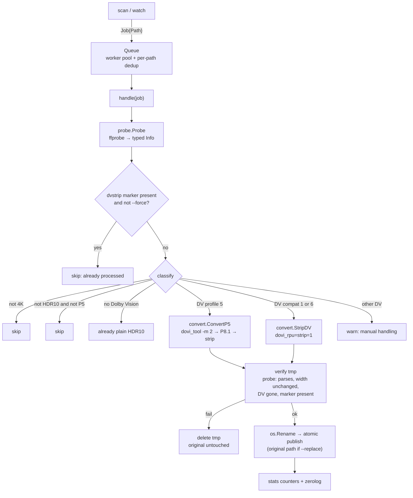

# How dvstrip works

This document describes the internal pipeline, from the moment a path is discovered to the moment a normalized file appears on disk.

## Pipeline overview



Each stage is described below.

## 1. Detection — `internal/probe`

`probe.Probe` shells out to ffprobe:

```
ffprobe -v error -select_streams v:0 \
  -show_entries stream=codec_name,width,height,pix_fmt,color_transfer,color_primaries:stream_side_data:format_tags \
  -of json <path>
```

The JSON is decoded into `probe.Info`, which answers five questions:

| Method | Rule |
|---|---|
| `Is4K()` | `width >= 3840` |
| `IsHDR10()` | `color_transfer == smpte2084` **and** `color_primaries == bt2020` |
| `HasDV` | a side-data entry `side_data_type == "DOVI configuration record"` exists; captures `dv_profile` and `dv_bl_signal_compatibility_id` |
| `HasHDR10Plus` | any side-data type containing `hdr10+` (case-insensitive) |
| `Processed` | container format tag `dvstrip` present, or a `comment` tag containing `dvstrip` — matched case-insensitively because **MP4 lowercases tag keys** while MKV preserves them |

`Info.Action()` collapses all of that into a single human-readable decision (`strip-dv`, `convert-p5`, `skip (…)`, …) which is exactly what `dvstrip check` prints.

**Testing seam:** `probe.Parse(raw []byte)` contains all the parsing/classification logic with no subprocess involved. Unit tests feed recorded ffprobe JSON fixtures through `Parse`; `Probe` is just "run ffprobe, then `Parse`".

## 2. Queueing — `internal/queue`

A fixed worker pool fed by a buffered channel (`workers * 8` capacity):

- `Submit` deduplicates by path with a `sync.Map` (`LoadOrStore`). A file being copied fires dozens of fsnotify `Write` events; after debounce you might still get the same path twice — only the first lands in the queue.
- `Wait` is a `sync.WaitGroup` over submitted-but-unfinished jobs; `scan` and watch-shutdown both call it to drain before exiting.
- `Submit` blocks when the buffer is full → the directory walk itself becomes the backpressure mechanism.
- **Auto worker count** (`--workers 0`, the default): `NumCPU/2` clamped to `[2, 8]`. Remuxing is I/O-bound and each ffmpeg stream-copy uses well under one core, so half the cores keeps disks busy without thrashing HDD arrays.

## 3. Conversion — `internal/convert`

### Normal path: `StripDV` (DV compat 1/6 — profiles 7.6, 8.1)

The strip path uses a single bitstream filter for both HEVC and AV1 streams, avoiding the old codec-specific `hevc_metadata=remove_dovi` split:

```
ffmpeg -hide_banner -loglevel error -nostats -y \
  -i <in> -map 0 -c copy \
  -bsf:v:0 dovi_rpu=strip=1 \
  -max_muxing_queue_size 2048 \
  -metadata dvstrip=1 \
  -metadata comment="dvstrip: dv -> hdr10 @ <RFC3339>" \
  .swp.dvstrip.<in>
```

`-c copy` means **stream copy**: no decoding, no re-encoding, bit-identical A/V/S. The only change is the removal of DV RPU / enhancement-layer metadata (HEVC NAL units or AV1 T.35 OBUs), plus the two container tags. The filter is pinned to `v:0` (the probed video stream) because `-map 0` also carries attached covers (mjpeg), which reject the video-only filter.

### Profile 5 path: `ConvertP5`

DV profile 5 has no HDR10-compatible base layer (it uses IPTPQc2 colors), so a bare strip would produce broken colors. The pipeline instead reshapes the DV metadata first — still no pixel re-encoding:

1. `ffmpeg -i <in> -map 0:v:0 -c:v copy -bsf:v hevc_mp4toannexb -f hevc <tmp>/bl.hevc` — extract the base layer as a raw Annex-B HEVC elementary stream. It must stay raw: dovi_tool (latest release 2.3.3) only reads elementary streams and rejects containers (`Matroska input is unsupported`).
2. `dovi_tool -m 2 convert --discard bl.hevc -o p8.hevc` — convert the RPU mapping from profile 5 to 8.1 and discard the enhancement layer.
3. Timing recovery: `mkvmerge -o timed.mkv --default-duration 0:<fps>p p8.hevc` — assign real timestamps to the raw stream (`<fps>` is the probed `r_frame_rate`, e.g. `24000/1001`). mkvmerge is the MKV-native equivalent of Tdarr's MP4Box; it is retried without `--default-duration` (auto-detecting the rate from the VUI) if the explicit rational form is rejected.
4. Merge: `-i timed.mkv -i <in> -map 0:v -map 1 -map -1:v -map_chapters 1 -c copy -bsf:v:0 dovi_rpu=strip=1` — video from the timed stream (everything else: audio, subs, chapters from the original), DV metadata stripped, marker stamped.

Why mkvmerge is needed: a raw HEVC elementary stream carries no container timestamps, and ffmpeg's h265 demuxer never generates them in the jellyfin-ffmpeg builds we target — so feeding the stream straight into the merge step aborts the mux with `Can't write packet with unknown timestamp`. No `-framerate`/`-genpts`/`-fps_mode` combination fixes this; only a real container muxer (mkvmerge here) can assign the timestamps.

See [hdr-metadata.md](hdr-metadata.md) for why this is done and the color-accuracy caveat.

### The tmp → verify → publish protocol

Both paths end in `publish()`:

1. **tmp**: ffmpeg writes to `.swp.dvstrip.<name><ext>` (e.g. `.swp.dvstrip.movie.mkv`) **in the same directory** as the source (same filesystem ⇒ atomic rename later). The leading dot makes it a hidden dotfile, so media scanners ignore it while it is in flight, and the video extension stays *last* in the name because ffmpeg picks the output muxer from the filename extension (an unknown suffix like `.tmp` makes it abort with "Unable to choose an output format"). Since the name now matches the scan/watch extension allow-list, `convert.IsTemp` (basename prefix match, checked before the extension filter in directory walks) is the explicit guard. The tmp file is unconditionally removed on return by a `defer` inside `StripDV`/`P5`, so a failed remux, a failed verification, a panic, or `os.Exit` all leave nothing behind — after a successful `publish` the rename has already moved it away and the removal is a no-op.
2. **verify**: the tmp file is re-probed with `probe.Probe`. Failure conditions (any of → delete tmp, keep original, report error):
   - probe fails to parse the file,
   - width changed vs. the source,
   - DV metadata is still present,
   - the source carried HDR10+ and the output no longer does (the ST 2094-40 SEI must survive the strip),
   - the `dvstrip` marker tag is missing.
3. **publish**: `os.Rename(tmp, final)` — POSIX rename-over is atomic. With `--replace`, `final` is the original path; otherwise it's `<name><suffix>.<ext>` (default `.hdr10`).

Consequences:

- `--replace` can never leave a half-written file: the original exists untouched until the verified rename.
- A hard crash (`SIGKILL`/power loss) can leave a `.swp.dvstrip.<name>.mkv` behind — in-process deferrals can't run. The next `scan` or `watch` sweep detects and removes it (logged at warn level; the retired `*.dvstrip.tmp` suffix is also still swept).
- In `watch` mode, the rename itself fires fresh fsnotify events on the original path — the debounced re-probe then finds the `dvstrip` marker and logs `[already processed]`, so there is no feedback loop. (Queue dedup + marker check are the two guards.)

## 4. Marker & idempotency

Every produced file carries two container-level tags written in the same remux pass (zero extra cost in MKV/MP4):

- `dvstrip=1` — machine-readable marker
- `comment=dvstrip: <from> -> <to> @ <timestamp>` — human-readable provenance

`probe` reads them back via `format_tags`. `handle` skips marked files unless `--force` is set. This is the primary idempotency mechanism; the secondary one is filename-based (`isOwnOutput`: `.swp.dvstrip.`-prefixed dotfiles and `<suffix>`-stemmed names are never enqueued).

## 5. Watch mode

- fsnotify is **not** recursive: at startup the whole tree is watched via `addRecursiveWatch`, and unreadable subtrees are skipped with a warning instead of aborting the watch. A directory appearing in the tree — created **or** moved in (an IN_MOVED_TO `Rename` carries the live new path) — is recursively watched (the entire subtree, not just the top dir, so files added later inside nested subdirs are still picked up) and its existing contents are walked immediately with the same eligibility rules as `submitDir`, but each file is routed through the **scheduler** so it too must settle before processing. If adding the watch for the arriving directory itself fails, it is logged and the contents are not scheduled (to avoid processing once but never monitoring).
- `--full-scan` enqueues the whole tree once before going live. Queue dedup makes any overlap with watcher events harmless.
- **Size-settling debounce** (`cmd/watch_scheduler.go`): every `Create`/`Write` event on a video file (re)arms a `time.AfterFunc` timer (default 5s) recording the file's current size. When the timer fires, the size is re-checked: changed → re-arm; gone (`os.IsNotExist`, e.g. renamed away) → dropped silently; transient `Stat` error → retried, never mistaken for a stable size; unchanged → submitted. Timer callbacks carry a generation counter so an already-fired callback from a replaced timer (`Timer.Stop` cannot withdraw it) is ignored — no early or double submissions.
- `Rename` is **accepted** so same-filesystem moves *into* the tree are processed (an IN_MOVED_TO `Rename` carries the live path and is never followed by a `Create`). The stale old-path event (IN_MOVED_FROM) and files renamed away are dropped by the scheduler's existence check (the path no longer `Stat`s).
- SIGINT/SIGTERM (wired through cobra's command context via `signal.NotifyContext`) stops the loop, **flushes the scheduler** (`Close` submits every pending file immediately rather than dropping it), drains the queue with `Wait()`, prints the summary counters, exits 0.

## 6. Logging, stats & progress bars

All log output goes through a single zerolog instance configured in `cmd/root.go` (`--log-level`, `--log-json`; console writer otherwise). Every file-scoped event carries a `file=<basename>` field. Run-end summary counters (scanned / skipped / marked / already-hdr10 / stripped / failed) are atomic and printed by `scan` and by `watch` on shutdown.

Progress display is on by default (`--no-progress` opts out; `--log-json` forces it off). ffmpeg never uses `-stats` — the raw `frame=…` line is what used to garble the log stream. Instead:

1. ffmpeg runs with `-nostats -progress pipe:1`, emitting machine-readable `key=value` blocks.
2. `convert.runFFmpeg` parses `total_size=N` lines and feeds them into `internal/display.Tracker`, keyed by file path (bar max = source file size; stream-copy output ≈ input, so the estimate is accurate). The bar description is just the file's basename, followed by percent, humanized `current/total` bytes, rate and `[elapsed:eta]` — the phase adds nothing when every bar belongs to the same pipeline.
3. `dovi_tool` and `mkvmerge` (no progress output) get an indeterminate spinner instead.
4. The tracker renders every active bar as its own line at the bottom of the terminal (via [mpb](https://github.com/vbauerster/mpb), which redraws the bar block in place). **All log writes go through the tracker's writer**, which prints them above the bars — so logs and bars never interleave. On a non-TTY (docker logs, redirected stderr, CI) mpb renders nothing; instead the tracker emits a `progress: <file> N%` log line each time a bar crosses a 10% milestone, so captured logs stay clean while still showing progress.

## 7. Disk-space gating

A conversion never starts until the destination filesystem provably has room for it. `internal/convert.SpaceGuard` (one instance shared by all workers via `Options.Space`) keeps a per-directory ledger of the bytes the **running** jobs still need (source size + 5% headroom, shrunk as ffmpeg reports bytes written). A new job may start only while `free − Σ(reserved) ≥ need`, so parallel workers can never collectively overrun the disk — the check looks at the projected final space left, not just the instantaneous free bytes.

- **`--replace`**: the extra space is temporary (the verified rename frees the original), so a job that doesn't fit yet **waits**, re-checking every 5 s until other jobs finish or Ctrl-C cancels it.
- **side-by-side (default)**: the output permanently adds a second file, so a failed check is an immediate per-file `ErrNoSpace` failure instead of letting ffmpeg die with ENOSPC mid-remux.

## Where things live

| Path | Responsibility |
|---|---|
| `cmd/root.go` | cobra root, viper binding, logger + tracker setup, signal context, PATH checks |
| `cmd/common.go` | `handle` (probe → classify → strip), `walkVideos`/`submitDir`, filters, stats |
| `cmd/check.go` | single-file structured report |
| `cmd/scan.go` | recursive one-shot scan |
| `cmd/watch.go` | fsnotify loop, new-directory pickup, `--full-scan` |
| `cmd/watch_scheduler.go` | `fileScheduler`: size-settling debounce with generation-guarded timers and `Close` flush |
| `internal/probe` | ffprobe wrapper (`Probe`) + pure parser/classifier (`Parse`, `Info.Action`) |
| `internal/convert` | `StripDV` (HEVC + AV1), `P5`, ffmpeg progress plumbing, tmp/verify/publish, `SpaceGuard` disk-space ledger |
| `internal/display` | multi-bar progress (mpb): one line per in-flight conversion on a TTY; 10% milestone log lines on non-TTY |
| `internal/queue` | worker pool, dedup, `AutoWorkers` |
